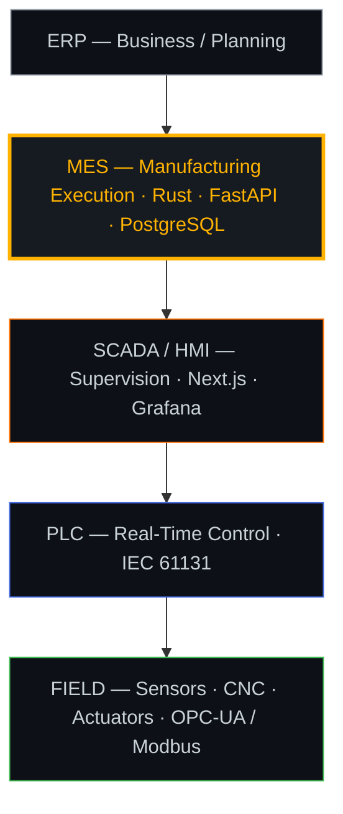

<div align="center">

[](https://github.com/LeandroPG19)


</div>

```
┌─ OPERATOR ──────────────────────────────────────────
│ Leandro Pérez G. — Systems Architect @ SIIOSA
│ Industrial Automation · MES · CNC · deterministic infra
│ ● ONLINE — zero residual risk by design
└─────────────────────────────────────────────────────
```

```rust
loop {
    let telemetry = plc.poll();                 // OPC-UA / Modbus TCP
    match controller.evaluate(telemetry) {
        Ok(command) => actuator.dispatch(command),
        Err(fault)  => safe_state.engage(fault), // fail-closed, always
    }
}
```

<div align="center">


</div>

<div align="center">

**Industrial Automation Stack — ISA-95**



<sub>Commands flow down · telemetry flows up — I architect the MES layer.</sub>

<br /><br />


<br /><br />

<picture>
  <source media="(prefers-color-scheme: dark)" srcset="https://raw.githubusercontent.com/LeandroPG19/LeandroPG19/output/snake.svg" />
  <source media="(prefers-color-scheme: light)" srcset="https://raw.githubusercontent.com/LeandroPG19/LeandroPG19/output/snake-light.svg" />
  
</picture>

<sub>▸ contribution sweep — auto-generated every 12 h by GitHub Actions</sub>

<br /><br />

[](https://linkedin.com/in/leandropg19)
[](mailto:leandropatodo@gmail.com)


</div>
