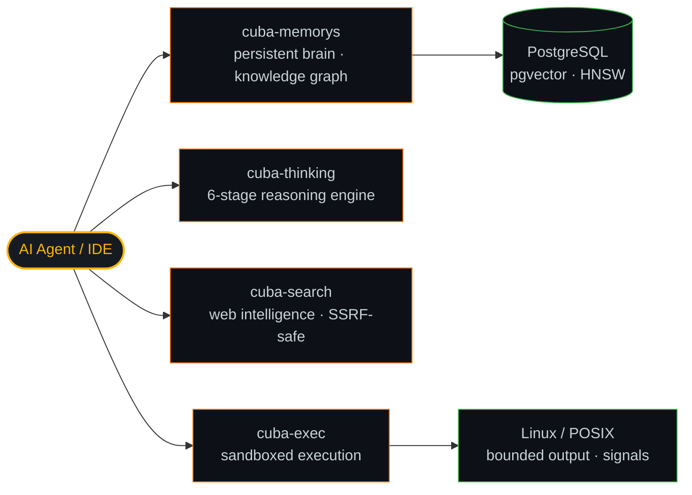

<div align="center">


[](https://github.com/LeandroPG19)


</div>

---

```
┌─ OPERATOR ───────────────────────────────────────────
│ NAME     Leandro Pérez G.
│ ROLE     Systems Architect @ SIIOSA
│ DOMAIN   Industrial Automation · MES · CNC manufacturing
│ STACK    Rust (2024) · Python 3.14 · TypeScript · PostgreSQL 18
│ FOCUS    Deterministic control infra · agent memory · telemetry
│ STATUS   ● ONLINE — shipping zero-residual-risk systems
└──────────────────────────────────────────────────────
```

## `//` SYSTEM OVERVIEW

Systems Architect building **industrial automation infrastructure** for CNC manufacturing environments — the layer between the PLC and the plant floor where a bug is not a stack trace, it's physical damage. I design deterministic, fully-auditable control and data systems in **Rust, Python 3.14 and Next.js**.

I also build the **`cuba-*` MCP ecosystem**: persistent agent memory with Hebbian learning and knowledge graphs, multi-step reasoning engines, real-time web intelligence, and sandboxed execution — the same discipline applied to AI infrastructure.

```rust
// The control law everything else inherits from.
loop {
    let telemetry = plc.poll();                 // OPC-UA / Modbus TCP
    match controller.evaluate(telemetry) {
        Ok(command) => actuator.dispatch(command),
        Err(fault)  => safe_state.engage(fault), // fail-closed, always
    }
}
```

```rust
const DOCTRINE: [&str; 3] = [
    "Zero Residual Risk    — 100% simulable, auditable, reversible logic",
    "Defensive by Design   — strict typing, immutability, ACID integrity",
    "Continuous Automation — if it needs a human, it's a bug",
];
```

---

## `//` SUBSYSTEMS

<div align="center">

**Core / Systems**


**Backend · Data · Telemetry**


**Industrial / Fieldbus**


**HMI / Frontend**


**Infra / Runtime**


</div>

---

## `//` cuba-* ECOSYSTEM



---

## `//` ACTIVE MODULES

<div align="center">

<a href="https://github.com/LeandroPG19/cuba-memorys">
  
</a>
<a href="https://github.com/LeandroPG19/cuba-thinking">
  
</a>

<a href="https://github.com/LeandroPG19/cuba-search">
  
</a>
<a href="https://github.com/LeandroPG19/cuba-exec">
  
</a>

</div>

---

## `//` SYSTEM TELEMETRY

<div align="center">


<br />


</div>

---

## `//` UPLINK

<div align="center">

[](https://linkedin.com/in/leandropg19)
[](mailto:leandropatodo@gmail.com)


</div>
